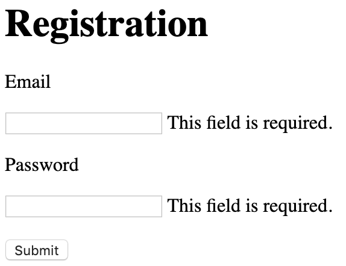

# Video Uploading Website 

## Functions

### Normal User

1. Users should register and login first on the website.
2. Users can upload one or multiple videos.
3. Users can check their uploaded videos.
4. Users can download uploaded videos.

### Administrator

1. Administrtor needs to login with admin account. Default account name is admin, password is 12345678.
2. After login, administrator can check and download all uploaded videos by all users.


## Details

### Registration

1. The user needs to provide email address and password. 
2. The validity of email address and password is checked.

###Upload Videos

1. The commonly used file types for mobile video recording should be supported (e.g. mov, mp4, 3pg, 'avi').
2. The child's age and gender should be provided while uploading the video.
4. The video should have size limit.

###Check Uploaded Videos

1. Uploaded videos are shown in list with file name, size, upload time, child's age, child's genger, uploader's id. 
2. When the file name is clicked, the video is downloaded to the user's computer.


## Technical Details

### UI Design

#### Login Page


The codes are inplemented in index.html

####Register Page



The codes are inplemented in register.html

#### Upload Page


The codes are inplemented in show.html

#### Check Video Page


The codes are inplemented in manage.html

### Flask App

```python
# -*- coding: utf-8 -*-
import os
import time
import hashlib

from flask import Flask, render_template, redirect, url_for, request, flash, send_from_directory
from flask_mongoengine import MongoEngine, Document
from flask_uploads import UploadSet, configure_uploads, IMAGES, patch_request_class
from flask_wtf import FlaskForm
from flask_wtf.file import FileField, FileRequired, FileAllowed
from wtforms import SubmitField
from wtforms import StringField, PasswordField, IntegerField, SelectField
from wtforms.validators import Email, Length, InputRequired, NumberRange
from werkzeug.security import generate_password_hash, check_password_hash
from flask_login import LoginManager, UserMixin, login_user, login_required, logout_user, current_user

application = Flask(__name__)
application.config['SECRET_KEY'] = 'I have a dream'
application.config['UPLOADED_VIDEOS_DEST'] = '/tmp/uploads'

application.config['MONGODB_SETTINGS'] = {
    'db': 'upload_video',
    'host': 'mongodb://localhost:27017/upload_video'
}

db = MongoEngine(application)
login_manager = LoginManager()
login_manager.init_app(application)
login_manager.login_view = 'login'

videos = UploadSet('videos', extensions=('mov', 'mp4', 'MOV', 'MP4', '3pg', '3GP', 'avi', 'AVI'))
configure_uploads(application, videos)
patch_request_class(application, 100 * 1024 * 1024)  # set maximum file size 100MB


class User(UserMixin, db.Document):
    meta = {'collection': 'user_collection'}
    email = db.StringField(max_length=30)
    password = db.StringField()


class Video(db.Document):
    meta = {'collection': 'video_collection'}
    file_name = db.StringField(max_length=30)
    email = db.StringField(max_length=30)
    age = db.IntField()
    gender = db.StringField()


class UploadForm(FlaskForm):
    video = FileField(validators=[FileAllowed(videos, 'Video Only!'), FileRequired('Choose a file!')])
    age = IntegerField('age', validators=[InputRequired(), NumberRange(0, 120)])
    gender = SelectField('gender', choices=[('male', 'Male'), ('female', 'Female')], validators=[InputRequired()])
    submit = SubmitField('Upload')


class RegForm(FlaskForm):
    email = StringField('email', validators=[InputRequired(), Email(message='Invalid email'), Length(max=30)])
    password = PasswordField('password', validators=[InputRequired(), Length(min=8, max=20)])


@login_manager.user_loader
def load_user(user_id):
    return User.objects(pk=user_id).first()


@application.route('/register', methods=['GET', 'POST'])
def register():
    form = RegForm()
    if request.method == 'POST':
        if form.validate():
            existing_user = User.objects(email=form.email.data).first()
            if existing_user is None:
                hashpass = generate_password_hash(form.password.data, method='sha256')
                hey = User(form.email.data, hashpass).save()
                login_user(hey)
                return redirect(url_for('upload_file'))
    return render_template('register.html', form=form)


@application.route('/', methods=['GET', 'POST'])
def login():
    if current_user.is_authenticated:
        return redirect(url_for('upload_file'))

    form = RegForm()
    wrong_password = False
    no_user = False
    if request.method == 'POST':
        if form.validate() or form.email.data == 'admin':
            # User.
            check_user = User.objects(email=form.email.data).first()
            if check_user:
                if check_password_hash(check_user['password'], form.password.data):
                    login_user(check_user)
                    flash('Logged in successfully.')
                    return redirect(url_for('upload_file'))
                else:
                    wrong_password = True
            else:
                no_user = True

    return render_template('index.html', form=form, wrong_password=wrong_password, no_user=no_user)


@application.route('/logout', methods=['GET'])
@login_required
def logout():
    logout_user()
    return redirect(url_for('login'))


@application.route('/show', methods=['GET', 'POST'])
@login_required
def upload_file():
    form = UploadForm()
    if form.validate_on_submit():
        for file in request.files.getlist('video'):
            query_video = Video.objects(email=current_user.email, file_name=file.filename).first()
            if query_video is not None:
                ext_num = 1
                while True:
                    file_name = file.filename[:-4] + '_' + str(ext_num) + file.filename[-4:]
                    query_video = Video.objects(email=current_user.email, file_name=file_name).first()
                    if query_video is None:
                        break
                    else:
                        ext_num += 1
            else:
                file_name = file.filename
            videos.save(file, folder=current_user.email, name=file_name)
            Video(file_name=file_name, email=current_user.email, age=form.age.data, gender=form.gender.data).save()
        success = True
    else:
        success = False
    return render_template('show.html', form=form, success=success, name=current_user.email)


@application.route('/manage')
def manage_file():
    files_list = []
    if current_user.email == 'admin':
        for email in os.listdir(application.config['UPLOADED_VIDEOS_DEST']):
            email_dir = os.path.join(application.config['UPLOADED_VIDEOS_DEST'], email)
            if os.path.isdir(email_dir):
                for file in os.listdir(email_dir):
                    if not file.startswith('.'):
                        query_video = Video.objects(email=email, file_name=file).first()
                        files_list.append([file, email, query_video['age'], query_video['gender']])

    else:
        files = os.listdir(os.path.join(application.config['UPLOADED_VIDEOS_DEST'], current_user.email))
        for file in files:
            query_video = Video.objects(email=current_user.email, file_name=file).first()
            files_list.append([file, current_user.email, query_video['age'], query_video['gender']])

    return render_template('manage.html', files_list=files_list, name=current_user.email)


@application.route('/open/<filename>')
def open_file(filename):
    file_url = videos.url(filename)
    return render_template('browser.html', file_url=file_url)


@application.route('/delete/<email>/<filename>')
def delete_file(filename, email):
    file_path = videos.path(os.path.join(email, filename))
    os.remove(file_path)
    query_video = Video.objects(email=email, file_name=filename).first()
    query_video.delete()
    return redirect(url_for('manage_file'))


@application.route('/download/<email>/<filename>', methods=['GET', 'POST'])
def download_file(filename, email):
    file_path = os.path.join(application.config['UPLOADED_VIDEOS_DEST'], email)
    return send_from_directory(directory=file_path, filename=filename, as_attachment=True)

if __name__ == '__main__':
    application.run(debug=True)

```


### MongoDB Collections

#### user_collection

fields: user_id, password, nickname

primary key: user_id

#### video_collection

fields: file_name, file_path, file_size, duration, child_age, child_name, user_id, upload_time

primary key: user_id, file_name


## Tutorial of Installing Flask App on Server

### Deploying a Python app on a Linux/Unix production server

https://www.phusionpassenger.com/library/walkthroughs/deploy/python/

```shell
sudo apt-get update
sudo apt-get install -y python
```

add the following code to .bashrc

```shell
export LC_ALL="en_US.UTF-8"
```

#### Step 1: install Passenger packages

```shell
sudo apt-get install -y dirmngr gnupg
sudo apt-key adv --keyserver hkp://keyserver.ubuntu.com:80 --recv-keys 561F9B9CAC40B2F7
sudo apt-get install -y apt-transport-https ca-certificates


sudo sh -c 'echo deb https://oss-binaries.phusionpassenger.com/apt/passenger xenial main > /etc/apt/sources.list.d/passenger.list'
sudo apt-get update

sudo apt-get install -y libapache2-mod-passenger
sudo apt-get install -y apache2
```

#### Step 2: enable the Passenger Apache module and restart Apache

```shell
sudo a2enmod passenger
sudo apache2ctl restart
```

#### Step 3: check installation

```shell
sudo /usr/bin/passenger-config validate-install
sudo /usr/sbin/passenger-memory-stats
```

### Deploying a Python app on a Linux/Unix production server

#### Install Git on the server

```shell
sudo apt-get install -y git
```

#### Pull code

```shell
sudo mkdir -p /var/www/cloud-drive
sudo chown ubuntu: /var/www/cloud-drive

cd /var/www
sudo -u ubuntu -H git clone https://github.com/jasonyanglu/cloud-drive.git
```

#### Install app dependencies

```shell
sudo apt install python-pip
sudo pip install flask
sudo pip install -r requirements.txt
```

#### Edit Apache configuration file

```shell
sudo vim /etc/apache2/sites-enabled/cloud-drive.conf
```

paste the following codes to cloud-drive.conf

    <VirtualHost *:80>
        ServerName 193.112.128.7
        
        # Tell Apache and Passenger where your app's code directory is
        DocumentRoot /var/www/cloud-drive
        PassengerAppRoot /var/www/cloud-drive
    
        # Tell Passenger that your app is a Python app
        PassengerAppType wsgi
        PassengerStartupFile app.py
    
        # Relax Apache security settings
        <Directory /var/www/cloud-drive>
          Allow from all
          Options -MultiViews
          # Uncomment this if you're on Apache >= 2.4:
          #Require all granted
        </Directory>
    </VirtualHost>
重启apache

```shell
sudo apache2ctl restart
```

### mongodb

#### Install

```shell
wget -qO - https://www.mongodb.org/static/pgp/server-4.2.asc | sudo apt-key add -
echo "deb [ arch=amd64 ] https://repo.mongodb.org/apt/ubuntu xenial/mongodb-org/4.2 multiverse" | sudo tee /etc/apt/sources.list.d/mongodb-org-4.2.list
sudo apt-get install -y mongodb
```

#### Run

```shell
sudo service mongodb start
mongo
```

#### Mongodb Commands

```m
use upload_video
db.createCollection('user_collection')
db.createCollection('video_collection')
show collections
db.user_collection.find()
```

After registering admin@google.com, change it to admin in the server by command：

```
db.user_collection.update({'email':'admin@google.com'}, {$set:{'email':'admin'}})
```

### Directory to Store Uploaded Videos

```
'/tmp/uploads'
```